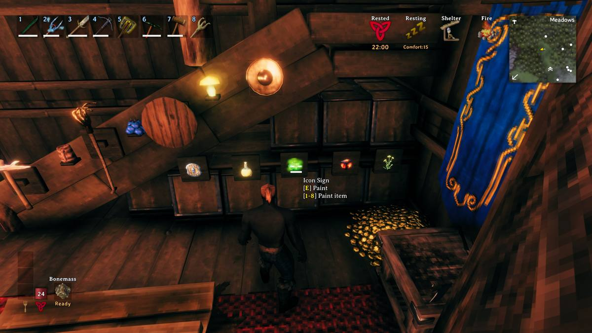

# IconSign

New sign that shows icons instead of text.

## Features

- 1000+ existing in game icons
- Categories for easy browsing
- Recent tab for quick access to recently used icons
- Inventory tag for quick access to inventory icons
- Hotbar assignment

## Refrence

Find the mod at [IconSign at Valheim Nexus - Mods and community](https://www.nexusmods.com/valheim/mods/2891)

built with [Jötunn](https://github.com/Valheim-Modding/Jotunn).  

## Screenshots

